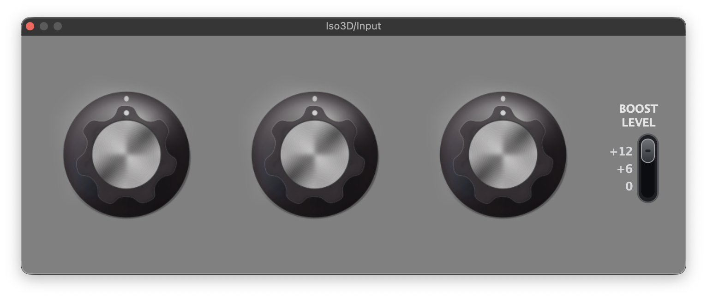

# Iso3D

A 3-band DJ isolator audio plugin inspired by Electronique & Spectacle (E&S) and TEIL3 B&.



## Features

- **3-band isolation** with crossover points at 250 Hz and 3140 Hz
- **LR4 crossover** (Linkwitz-Riley 4th order, 24 dB/oct) for clean band separation
- **Per-band gain** from full kill (-100 dB) to boost (+12 dB)
- **Configurable boost limiter** (0 dB, +6 dB, +12 dB)
- **Click-free transitions** via EMA gain smoothing (5ms time constant)
- **Zero latency** (pure IIR, sample-by-sample processing)
- **Formats:** Standalone, VST3, AU

## MIDI Controller

You can map this plugin to a MIDI controller with 3 knobs. We created a custom controller with Jérôme Barbé. It is based on Arduino UNO R4 and I'm planning to open source the code. Stay tuned!

## Building

Requires CMake 3.22+, Ninja, and a C++20 compiler.

```bash
# Debug build
cmake --preset default
cmake --build build

# Release build
cmake --preset release
cmake --build release-build

# Run tests
cd build && ctest
```

## Installing

```bash
# Install release plugins to ~/Library/Audio/Plug-Ins/
./scripts/install-plugins.sh --release
```

## Parameters

| Parameter | Range | Default | Description |
|-----------|-------|---------|-------------|
| Low | -100 to +12 dB | 0 dB | Low band gain (< 250 Hz) |
| Mid | -100 to +12 dB | 0 dB | Mid band gain (250 Hz - 3140 Hz) |
| High | -100 to +12 dB | 0 dB | High band gain (> 3140 Hz) |
| Boost | 0 / +6 / +12 dB | 0 dB | Maximum boost level |

## Architecture

```
Input -> LR4(250Hz) -> LP -> Low band  -> gain -> ╲
                    -> HP -> LR4(3140Hz) -> LP -> Mid band  -> gain ->  sum -> Output
                                         -> HP -> High band -> gain -> ╱
```

Uses JUCE's `LinkwitzRileyFilter` (TPT structure) which guarantees LP + HP = allpass (flat magnitude response).

## License

[MIT](LICENSE.md)